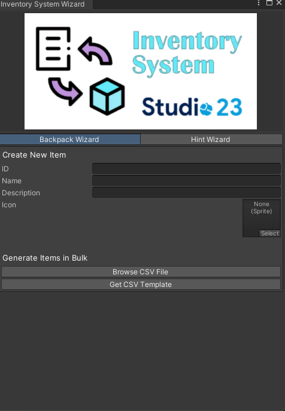

<h1 align="center">Inventory System</h1><p align="center">
<a href="https://openupm.com/packages/com.studio23.ss2.inventorysystem/"></a>
</p>

Inventory System is a boilerplate library for implementing Inventory needs for your game.


## Table of Contents

1. [Installation](#installation)
2. [Usage](#usage)


## Installation

### Install via Git URL

You can also use the "Install from Git URL" option from Unity Package Manager to install the package.
```
https://github.com/Studio-23-xyz/Inventory-System.git#upm
```

## Usage

### Using Inventory System

1. Access the Inventory System Wizard from top toolbar Studio-23 > Inventory System > Wizard
2. Create new items by manually putting names and icons Or Bulk Create
3. Get the csv template using the get template button.
4. Create the icons folder and put all the icons in there.
5. in the template name the icons with their items
6. Press Generate


